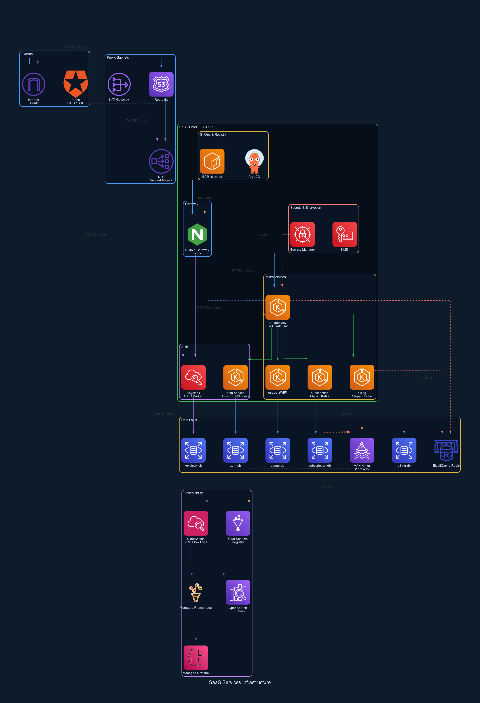

# saas-services-infra

> **Work in Progress** — This infrastructure is actively under development. Not all components are production-ready.

[](https://www.terraform.io/)
[](https://aws.amazon.com/)
[](https://kubernetes.io/)
[](./LICENSE)
[](https://github.com)

## Tags

`in-development` `terraform` `aws-infrastructure` `eks` `saas` `microservices`

Terraform infrastructure for a multi-service SaaS platform on AWS. Provisions a full EKS-based environment with managed databases, messaging, observability, and auth — across `dev`, `staging`, and `prod` environments.

---

## Architecture Overview



**Services deployed to EKS:**
- `api-gateway` — JWT validation, rate limiting, Redis-backed session
- `auth-service` — Custom JWT auth (dev) or Keycloak (prod)
- `subscription-service` — Plan management, Kafka events
- `billing-service` — Stripe integration, Kafka consumer
- `usage-service` — Usage tracking

---

## Modules

| Module | Description |
|--------|-------------|
| `modules/eks` | EKS cluster, node group, IRSA roles, security groups, AWS Verified Access |
| `modules/k8s-and-helm` | Helm releases: NGINX Gateway, cert-manager, external-dns, ArgoCD, Airflow, Keycloak |
| `modules/rds` | PostgreSQL RDS instances (one per service) |
| `modules/elasticache` | Redis ElastiCache cluster |
| `modules/kafka` | Amazon MSK (Kafka) + Glue Schema Registry |
| `modules/elk` | OpenSearch domain + IRSA for OTel collector |
| `modules/grafana` | Amazon Managed Grafana + Managed Prometheus |
| `modules/otel` | OpenTelemetry Collector (K8s DaemonSet) |

---

## Environments

| Environment | Config | Auth | Observability | EKS Access |
|-------------|--------|------|---------------|------------|
| `dev` | `dev.tfvars` | Custom auth-service | Grafana | Public endpoint |
| `staging` | `stage.tfvars` | Keycloak | ELK | Private |
| `prod` | `prod.tfvars` | Keycloak + Auth0 OIDC | ELK | Private + AWS Verified Access |

### Auth Providers

Two auth strategies are supported via `auth_provider`:

- **`auth-service`** (dev) — Lightweight custom JWT service with its own RDS instance
- **`keycloak`** (prod) — Full Keycloak deployment on EKS backed by its own RDS instance; federates with Auth0 via OIDC in prod

### Observability Stacks

Switchable via `observability`:

- **`elk`** — Amazon OpenSearch + OTel Collector → OpenSearch
- **`grafana`** — Amazon Managed Grafana + Managed Prometheus + OTel Collector

---

## Prerequisites

- Terraform `>= 1.3.0`
- AWS CLI configured with appropriate permissions
- `kubectl` and `helm` (for K8s module)
- S3 bucket `saas-state-bucket-399849` (remote state backend)

---

## Usage

```bash
# Initialize
terraform init

# Plan for a specific environment
terraform plan -var-file=dev.tfvars

# Apply
terraform apply -var-file=dev.tfvars

# Prod (with Verified Access)
terraform apply -var-file=prod.tfvars
```

### Sensitive Variables

Never commit secrets. Pass them via environment variables:

```bash
export TF_VAR_auth_db_password="..."
export TF_VAR_subscription_db_password="..."
export TF_VAR_billing_db_password="..."
export TF_VAR_usage_db_password="..."
export TF_VAR_opensearch_master_password="..."
export TF_VAR_stripe_api_key="..."
export TF_VAR_openai_api_key="..."

# Keycloak (prod)
export TF_VAR_keycloak_db_password="..."
export TF_VAR_ava_oidc_client_secret="..."
export TF_VAR_auth0_client_secret="..."

# Auth-service (dev)
export TF_VAR_auth_jwt_secret="..."
export TF_VAR_auth_jwt_refresh_secret="..."
export TF_VAR_gateway_jwt_secret="..."
```

---

## ECR Repositories

The following ECR repositories are provisioned with KMS encryption and immutable tags:

- `api-gateway`
- `auth-service`
- `subscription-service`
- `billing-service`
- `usage-service`

---

## Security

- EKS secrets encrypted with a dedicated KMS key
- All RDS instances encrypted at rest (KMS)
- MSK encryption in transit and at rest (KMS)
- ElastiCache encrypted at rest (KMS)
- ECR images scanned on push
- IMDSv2 enforced on EKS nodes
- VPC Flow Logs → CloudWatch
- EKS control plane logs: `api`, `audit`, `authenticator`, `controllerManager`, `scheduler`
- Prod: private EKS API endpoint + AWS Verified Access (Zero Trust)

---

## State Backend

Remote state is stored in S3 with native locking:

```hcl
backend "s3" {
  bucket       = "saas-state-bucket-399849"
  key          = "saas-services/terraform.tfstate"
  region       = "us-east-1"
  use_lockfile = true
  encrypt      = true
}
```

---

## Project Status

> This project is under active development. The following areas are still being worked on:

- [ ] Usage service infrastructure (RDS provisioned, service Helm chart pending)
- [ ] Airflow DAGs and production configuration
- [ ] Stage environment parity with prod
- [ ] CI/CD pipeline integration
- [ ] Disaster recovery / backup policies
- [ ] Secure password protection for RDS
- [ ] Loose coupling of services credentials from remote backend s3 of the main infra

---

## Repository Structure

```
.
├── main.tf                  # Root module — VPC, EKS, RDS, MSK, Redis, secrets
├── variables.tf
├── outputs.tf
├── provider.tf              # AWS provider + S3 backend
├── local.tf                 # Locals (subnets, observability map, service list)
├── ecr.tf                   # ECR repositories
├── kms.tf                   # KMS key
├── iam.tf                   # VPC flow log IAM role
├── cloud-watch.tf           # CloudWatch log group
├── schema-registry.tf       # Glue Schema Registry
├── dev.tfvars
├── stage.tfvars
├── prod.tfvars
├── modules/
│   ├── eks/                 # EKS cluster, nodes, IRSA, security groups, Verified Access
│   ├── k8s-and-helm/        # Helm: NGINX, cert-manager, external-dns, ArgoCD, Keycloak, Airflow
│   ├── rds/                 # PostgreSQL RDS
│   ├── elasticache/         # Redis
│   ├── kafka/               # MSK
│   ├── elk/                 # OpenSearch
│   ├── grafana/             # Managed Grafana + Prometheus
│   └── otel/                # OpenTelemetry Collector
└── {service}/               # Per-service Terraform workspaces (auth, billing, subscription, api-gateway)
```
