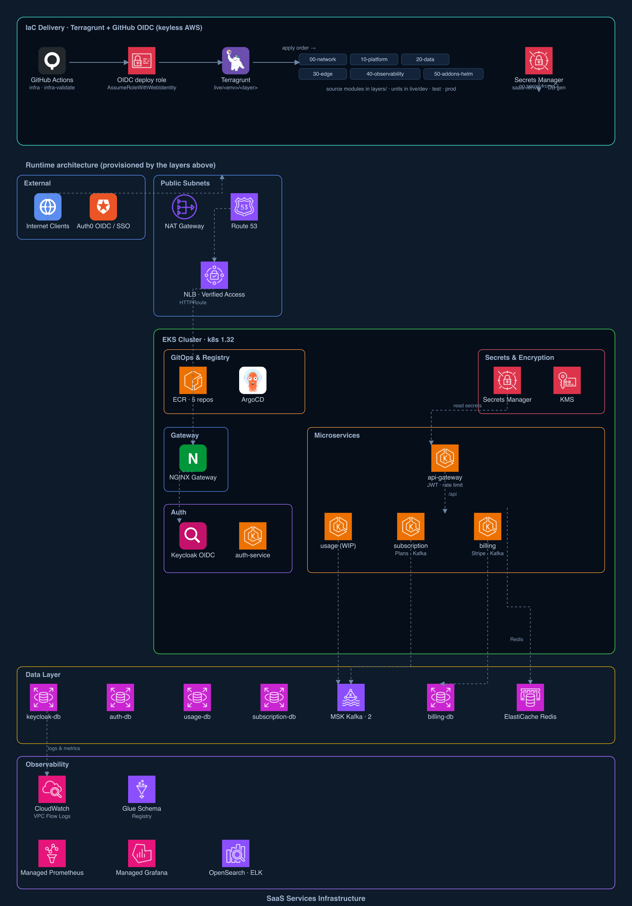

# saas-services-infra

> **Work in Progress** — This infrastructure is actively under development. Not all components are production-ready.

[](https://www.terraform.io/)
[](https://aws.amazon.com/)
[](https://kubernetes.io/)
[](./LICENSE)
[](https://github.com)

## Tags

`in-development` `terraform` `aws-infrastructure` `eks` `saas` `microservices`

Terraform + **Terragrunt** infrastructure for a multi-service SaaS platform on AWS. Provisions a full EKS-based environment with managed databases, messaging, observability, and auth — across `dev`, `test`, and `prod` environments, delivered keylessly via GitHub Actions OIDC.

---

## Architecture Overview



Delivered as **Terragrunt layers** (`live/<env>/00-network → 50-addons-helm`) sourcing the
modules in `layers/`, applied by GitHub Actions via keyless AWS **OIDC**. Application secrets
are generated (DB) or read from **Secrets Manager** — none are passed from CI.

**Services deployed to EKS:**
- `api-gateway` — JWT validation, rate limiting, Redis-backed session
- `auth-service` — Custom JWT auth (dev) or Keycloak (prod)
- `subscription-service` — Plan management, Kafka events
- `billing-service` — Stripe integration, Kafka consumer
- `usage-service` — Usage tracking

---

## Modules

Reusable building blocks in `modules/`, composed by the layers in `layers/`:

| Module | Description |
|--------|-------------|
| `modules/guardrails` | Per-environment security posture + tags (the `sizing`/`auth_provider`/`observability` policy engine every layer consumes) |
| `modules/eks` | EKS cluster, node group, IRSA roles |
| `modules/node-security-group` / `modules/data-security-groups` | Node + data-tier security groups |
| `modules/verified-access` | AWS Verified Access (Zero-Trust EKS API front door, prod) |
| `modules/k8s-and-helm` | Helm releases: NGINX Gateway, cert-manager, external-dns, ArgoCD, Airflow, Keycloak |
| `modules/rds` | PostgreSQL RDS instances (one per service); generates the master password → Secrets Manager |
| `modules/elasticache` | Redis ElastiCache cluster |
| `modules/msk` | Amazon MSK (Kafka) |
| `modules/elk` | OpenSearch domain + IRSA for OTel collector |
| `modules/grafana` | Amazon Managed Grafana + Managed Prometheus |
| `modules/observability` | Observability facade — picks `elk` or `grafana` per env |
| `modules/otel` | OpenTelemetry Collector (K8s DaemonSet) |
| `modules/iam` | Shared IAM (VPC flow-log role, etc.) |

---

## Environments

Infrastructure is delivered with **Terragrunt** (env-by-directory). Each environment is a
directory under `live/<env>/` holding one thin unit per layer; shared identity lives in
`live/<env>/env.hcl` and the DRY backend/provider generation in `root.hcl`.

| Environment | Live tree | Auth | Observability | EKS Access |
|-------------|-----------|------|---------------|------------|
| `dev` | `live/dev/` | Custom auth-service | Grafana | Public endpoint (CIDR-allowlisted) |
| `test` | `live/test/` | Keycloak | ELK | Public endpoint (CIDR-allowlisted) |
| `prod` | `live/prod/` | Keycloak + Auth0 OIDC | ELK | Private + AWS Verified Access |

### Auth Providers

Two auth strategies are supported via `auth_provider`:

- **`auth-service`** (dev) — Lightweight custom JWT service with its own RDS instance
- **`keycloak`** (prod) — Full Keycloak deployment on EKS backed by its own RDS instance; federates with Auth0 via OIDC in prod

### Observability Stacks

Switchable via `observability`:

- **`elk`** — Amazon OpenSearch + OTel Collector → OpenSearch
- **`grafana`** — Amazon Managed Grafana + Managed Prometheus + OTel Collector

---

## Prerequisites

- Terraform `>= 1.3.0` (CI pins `~1.14.8`)
- Terragrunt `v1.1.0` (installed by CI via `.github/actions/setup-terragrunt`)
- AWS CLI configured with appropriate permissions
- `kubectl` and `helm` (for the addons/K8s layer)
- S3 bucket `saas-state-bucket-399849` (remote state backend, native S3 locking)

---

## Usage

Everything runs through the `Makefile`, which wraps Terragrunt. The layer numbers
encode apply order (`00-network` → `50-addons-helm`); services live in `live/services/`.

```bash
# Plan / apply one layer in one env
make plan  ENV=dev LAYER=00-network
make apply ENV=dev LAYER=00-network

# Whole stack, dependency-ordered
make plan-all  ENV=prod
make apply-all ENV=prod

# A single service (live/services/<env>/<svc>)
make svc-plan  ENV=test SERVICE=api-gateway
make svc-apply ENV=test SERVICE=api-gateway

# HCL-only checks (no cloud): fmt + render every unit with mocks
make fmt-check
make tg-render
make svc-render
```

CI never applies from a laptop for shared envs — see the workflows below. Secrets are
**not** passed on the command line; see [Secrets](#secrets--no-secret-is-passed-from-cigithub).

---

## ECR Repositories

The following ECR repositories are provisioned with KMS encryption and immutable tags:

- `api-gateway`
- `auth-service`
- `subscription-service`
- `billing-service`
- `usage-service`

---

## Security

- EKS secrets encrypted with a dedicated KMS key
- All RDS instances encrypted at rest (KMS)
- MSK encryption in transit and at rest (KMS)
- ElastiCache encrypted at rest (KMS)
- ECR images scanned on push
- IMDSv2 enforced on EKS nodes
- VPC Flow Logs → CloudWatch
- EKS control plane logs: `api`, `audit`, `authenticator`, `controllerManager`, `scheduler`
- Prod: private EKS API endpoint + AWS Verified Access (Zero Trust)

### Secrets — no secret is passed from CI/GitHub

Terraform receives **zero** application secrets as `TF_VAR_*` from GitHub. Two patterns:

- **Database master passwords** are *generated* by `modules/rds` (`password = null` in
  `layers/20-data`) and written to Secrets Manager as `{username,password,endpoint,db_name}`;
  the service roots read them back by ARN. No human ever handles them.
- **Third-party / app secrets** are seeded **out-of-band** into Secrets Manager and *read*
  by the config via `data "aws_secretsmanager_secret_version"`. The deploy role
  (`AWS_DEPLOY_ROLE_ARN`) needs `secretsmanager:GetSecretValue` (it has it — Admin).

| Secret (Secrets Manager id)     | Shape                              | Read by |
| ------------------------------- | ---------------------------------- | ------- |
| `saas/<env>/stripe-api-key`     | plain string                       | billing-service |
| `saas/<env>/auth-jwt`           | `{secret, refresh_secret}`         | auth-service |
| `saas/<env>/opensearch-master`  | `{username, password}`             | 40-observability, 50-addons-helm (elk only) |
| `saas/<env>/auth0`              | `{client_id, client_secret}`       | 30-edge (Verified Access, prod only) |
| `saas/api-gateway-input`        | `{JWT_SECRET}` (pre-existing)      | api-gateway |

Seed them once per environment from your local (gitignored) `secrets.<env>.env`:

```bash
./scripts/seed-secrets.sh prod      # create-or-update; values never printed
```

After seeding, **delete these repo/environment GitHub secrets** (now unused):
`TF_VAR_KEYCLOAK_DB_PASSWORD`, `TF_VAR_SUBSCRIPTION_DB_PASSWORD`, `TF_VAR_BILLING_DB_PASSWORD`,
`TF_VAR_USAGE_DB_PASSWORD`, `TF_VAR_AUTH_DB_PASSWORD`, `TF_VAR_OPENSEARCH_MASTER_PASSWORD`,
`TF_VAR_OPENAI_API_KEY` (was undeclared — silently ignored), `TF_VAR_AVA_OIDC_CLIENT_ID`,
`TF_VAR_AVA_OIDC_CLIENT_SECRET`, `TF_VAR_AUTH_JWT_SECRET`, `TF_VAR_AUTH_JWT_REFRESH_SECRET`,
`TF_VAR_KEYCLOAK_JWKS_URL`, `TF_VAR_GATEWAY_JWT_SECRET`, `TF_VAR_STRIPE_API_KEY`.
Only `AWS_DEPLOY_ROLE_ARN` and `INFRACOST_API_KEY` remain.

---

## Policy as Code

Terraform passes through **three guardrail layers** before it reaches AWS — in CI
on every PR ([`.github/workflows/infra-validate.yml`](.github/workflows/infra-validate.yml))
and again as the enforced Atlantis apply gate. See [`policy/README.md`](policy/README.md).

| Layer | Tool | Catches |
|---|---|---|
| Lint | `tflint` (+ AWS ruleset) | Provider misuse, deprecated syntax, bad instance types, naming |
| Security scan | `checkov` | ~1k CIS/AWS benchmarks over HCL + plan |
| Strict PAC | OPA/Rego via `conftest` | Org rules on the *plan*: encryption, public exposure, admin-port CIDRs, IAM `*:*`, tagging |

```bash
make guardrails    # lint + checkov + policy-test (hermetic, no cloud creds)
make policy        # plan -> show -json -> conftest test (needs AWS creds)
```

**Atlantis** runs the same Rego set natively: with `--enable-policy-checks`, a
`policy_check` stage evaluates every plan and blocks apply on a `deny` until a
policy owner runs `atlantis approve_policies`. Config is version-controlled at
[`atlantis/repos.yaml`](atlantis/repos.yaml) — see [`ATLANTIS.md`](ATLANTIS.md#policy-checks-guardrails).

## Cost estimation

Every infra PR also gets a cloud-cost estimate from
[Infracost](https://www.infracost.io/) — informational, it never gates a merge.

- **CI** ([`.github/workflows/infracost.yml`](.github/workflows/infracost.yml)):
  plans the cost-bearing `test` layers, reads each plan JSON, and posts one
  combined cost comment on the PR.
- **Atlantis**: the `terragrunt` plan workflow appends an `infracost breakdown`
  table to each plan comment (see [`ATLANTIS.md`](ATLANTIS.md#required-environment-on-the-atlantis-server)).

```bash
make infracost     ENV=prod LAYER=20-data   # one unit
make infracost-all ENV=prod                 # all cost-bearing layers
```

Both need `INFRACOST_API_KEY` (free, from `infracost auth login`). CI also needs
it as a repo secret alongside `AWS_DEPLOY_ROLE_ARN`.

---

## State Backend

Remote state is stored in S3 with native locking:

```hcl
backend "s3" {
  bucket       = "saas-state-bucket-399849"
  key          = "saas-services/terraform.tfstate"
  region       = "us-east-1"
  use_lockfile = true
  encrypt      = true
}
```

---

## Project Status

> This project is under active development. The following areas are still being worked on:

- [ ] Usage service infrastructure (RDS provisioned, service Helm chart pending)
- [ ] Airflow DAGs and production configuration
- [ ] Stage environment parity with prod
- [x] CI/CD pipeline integration
- [x] Cost estimation on PRs (Infracost — CI + Atlantis)
- [ ] Disaster recovery / backup policies
- [x] Secure password protection for RDS (generated by `modules/rds` → Secrets Manager; never in CI)
- [x] Loose coupling of service credentials from the infra state (secrets read from Secrets Manager, `saas/<env>/*`)

---

## Repository Structure

Terragrunt drives everything: `layers/` and the service dirs are the **source modules**;
`live/<env>/` are the thin per-environment units that set `inputs` and are wired together
by dependency blocks. `root.hcl` generates the S3 backend + base AWS provider for all units.

```
.
├── root.hcl                     # DRY core: remote_state (S3 + lock) + generated aws provider
├── Makefile                     # plan/apply/render/fmt wrappers over terragrunt
│
├── layers/                      # Source modules, numbered by apply order
│   ├── 00-network/              # VPC, subnets, NAT, Route53, Glue Schema Registry
│   ├── 10-platform/             # EKS cluster + node groups
│   ├── 20-data/                 # RDS (per service), ElastiCache Redis, MSK Kafka
│   ├── 30-edge/                 # NLB + AWS Verified Access (prod Zero-Trust)
│   ├── 40-observability/        # OpenSearch (elk) / Managed Grafana+Prometheus
│   └── 50-addons-helm/          # Helm addons: NGINX, ArgoCD, Keycloak, OTel, ...
│
├── live/                        # Terragrunt units (env-by-directory)
│   ├── _envcommon/              # Shared per-layer config (deps, mock_outputs)
│   ├── dev/  test/  prod/       # <env>/<layer>/terragrunt.hcl  (+ env.hcl)
│   └── services/                # App services, per env
│       ├── _envcommon/          # Shared per-service config
│       └── test/  prod/         # <env>/<service>/terragrunt.hcl
│
├── api-gateway/  auth-service/  # Service source modules (ECS/EKS task config +
│   billing-service/  subscription-service/   Secrets Manager reads)
│
├── modules/                     # Reusable modules (see Modules table)
│
├── policy/                      # Policy-as-Code
│   ├── opa/  terraform/         # Rego (Conftest) — plan-level guardrails
│   └── checkov/                 # Custom Checkov checks
│
├── .github/
│   ├── workflows/               # infra, infra-validate, infracost, dependabot-auto-merge
│   └── actions/setup-terragrunt # Pinned terragrunt installer
│
├── atlantis/  atlantis.yaml     # Atlantis (enforced apply gate) config
├── migration/                   # One-shot scripts that moved the flat root → layers
├── scripts/                     # seed-secrets.sh, apply-stepwise.sh, verify-apply.sh
├── secrets.dev.env  secrets.prod.env   # gitignored — local source for seed-secrets.sh
├── architecture.svg / .png      # Architecture + Terragrunt delivery diagram (SVG = editable source)
└── graph.png                    # Terraform dependency graph
```
